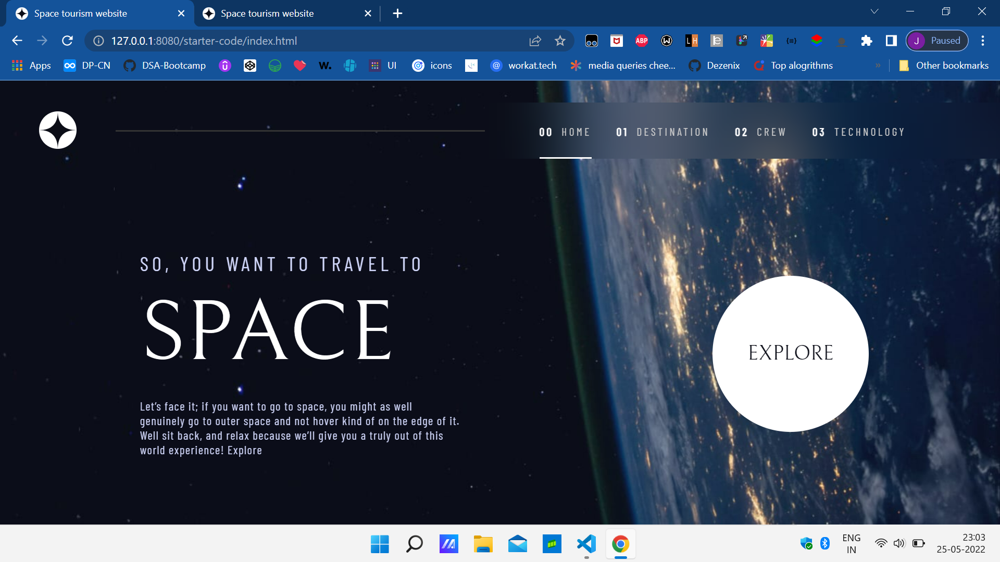

# Frontend Mentor - Space tourism website solution

This is a solution to the [Space tourism website challenge on Frontend Mentor](https://www.frontendmentor.io/challenges/space-tourism-multipage-website-gRWj1URZ3). Frontend Mentor challenges help you improve your coding skills by building realistic projects.

## Overview

### Screenshot

### Links

- Solution URL: 
- Live Site URL: 

## My process

### Built with

- Semantic HTML5 markup
- CSS custom properties
- Flexbox
- CSS Grid
- JavaScript

### Useful resources

- [BrowserStack](https://www.browserstack.com/guide/ideal-screen-sizes-for-responsive-design) - This website helped me for writing media queries for all type of devices, they had most commonly used screen-ratio stats.

## Author

- Frontend Mentor - [@Jashwanth-k](https://www.frontendmentor.io/profile/Jashwanth-k)
- Twitter - [@Jashwanth878](https://twitter.com/Jashwanth878?t=oqG0Um0f5eAQKBATPWCJSg&s=09)
